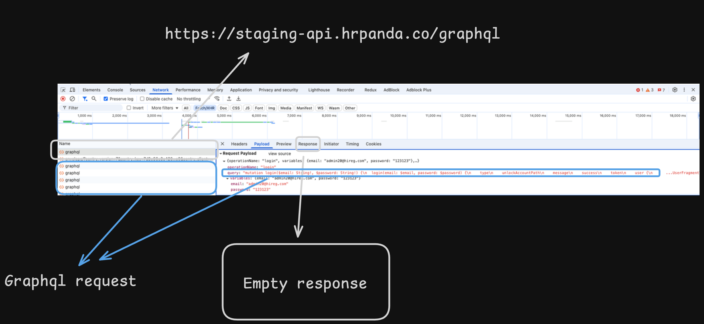
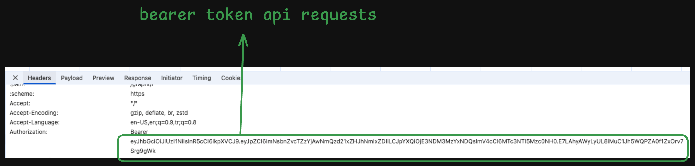
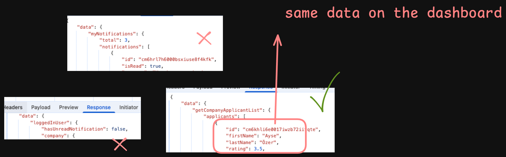
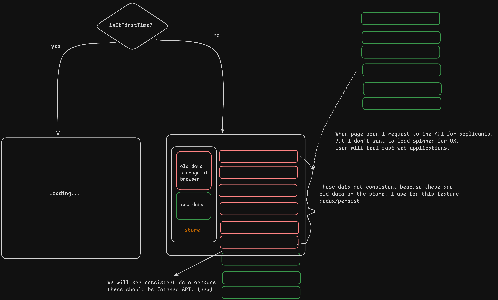

# Univenn Frontend Developer Challenge
project link: https://univenn-frontend-developer-challenge.vercel.app/dashboard/talent-pool
Hello, I will talk about the details of their project in this case study I have completed for Univenn. So, first of all, in this document you will learn about: 

- How can I request for this api adress: https://staging-dashboard.hrpanda.co
- Consistence level of applicants (performance optimization)
- Responsive design
- Components
- Developer experince
- Folder structure

# API request
So, I first tried to make a request with basic authentication with email and password. I got 200 OK messages but I only saw the page content in the response.

- I analyzed what happens in the network when logged in as in figure 1.0.


I realized that graphql was used. I also got a Bearer tokken because I logged in at the same time.


- I also analyzed the request that had the data that matched the data in the list in the dashboard among the many graphql requests. And I generated types of response for using with redux toolkit, redux persist.


# Consistence level of applicants (performance)
- If you are entering the website I have developed for the first time, you will see the loading text. 


### Why is it so important? and how did I control it?
Because the candidate data retrieved from the API is not critical to maintain in a fully consistent state, the UI prioritizes speed over perfect accuracy. By immediately displaying cached or partially loaded data, users experience faster page loads without having to wait for a spinner. This approach enhances the perception of a high-performance application, even if some entries are temporarily outdated or incomplete.


# HR Panda API Client

A TypeScript implementation for interacting with the HR Panda GraphQL API, specifically for managing applicant data.

### GraphQL Queries

#### Get Company Applicant List

```graphql
query GetCompanyApplicantList($where: ApplicantWhereInput, $orderBy: [ApplicantOrderByWithRelationInput!], $cursor: ApplicantWhereUniqueInput, $take: Int, $skip: Int, $distinct: [ApplicantScalarFieldEnum!]) {
  applicants(where: $where, orderBy: $orderBy, cursor: $cursor, take: $take, skip: $skip, distinct: $distinct) {
    # Applicant fields
  }
}

import { useApplicants } from './api/applicant';

const { data, loading, error } = useApplicants({
  where: { /* filter conditions */ },
  orderBy: { /* sorting */ },
  take: 10, // limit
  skip: 0,  // offset
});
```
### Core Dependencies
- **React 19**: The foundation for building reactive, component-based UIs.
- Vite: Blazing-fast build tool for instant HMR and optimized production bundles.
- Redux Toolkit + React-Redux: State management for centralized and predictable data flow.
- React Router v7: Client-side navigation and dynamic routing.

### Integrations  
- **GraphQL API**: Real-time data fetching via Apollo Client.  
- **Debounced Hooks**: Optimized search/input handling with `use-debounce`.  
- **Radix + Tailwind**: Seamless theming and accessibility compliance.  

### UI & Styling
- **Tailwind CSS + Merge/Animate**: Utility-first CSS with dynamic class composition and animations.
- **Radix UI**: Unstyled, accessible primitives (dropdowns, dialogs, etc.) for custom designs.
- **TanStack Table v8**: Headless table library for performant data grids.
- **Lucide React**: Lightweight icon set for intuitive UI elements.

### Developer Experience
- **TypeScript**: Static typing for safer code.
- **ESLint**: Code quality enforcement with React-specific rules.
- **Redux Persist**: Session persistence for state hydration across page reloads.

## Custom Components without shadcn/ui

| Component             | Path                                                                |
| ----------------- | ------------------------------------------------------------------ |
| ai-input | components/ui/ai-input-with-loading |
| use-auto-resize-textarea | components/ui/use-auto-resize-textarea |
| mobile-controller | components/ui/mobile-controller -> for responsive design |
| pdf-viewer | components/ui/pdf-viewer -> right side sheet component for opening resumes |

